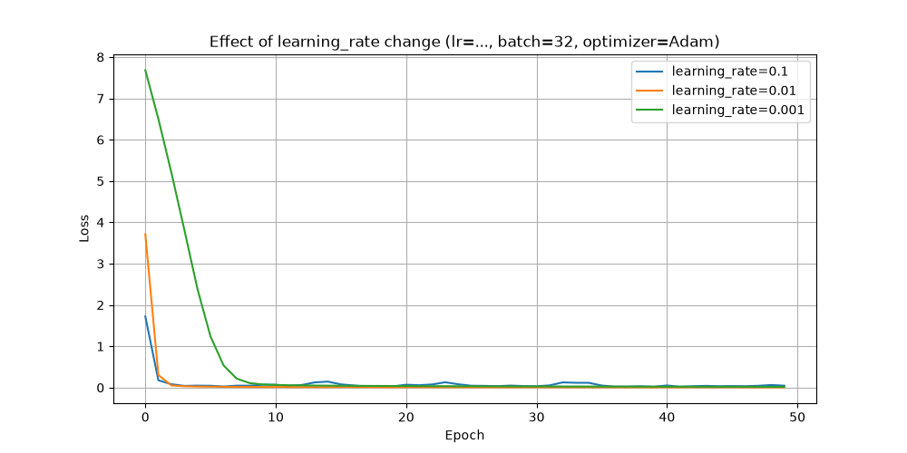
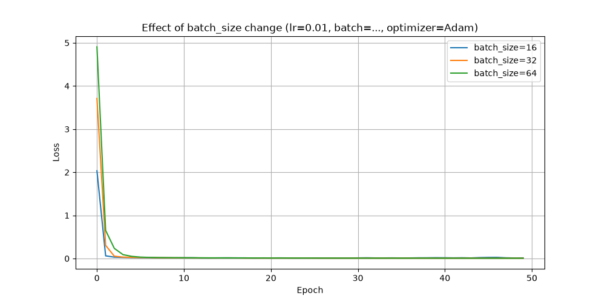
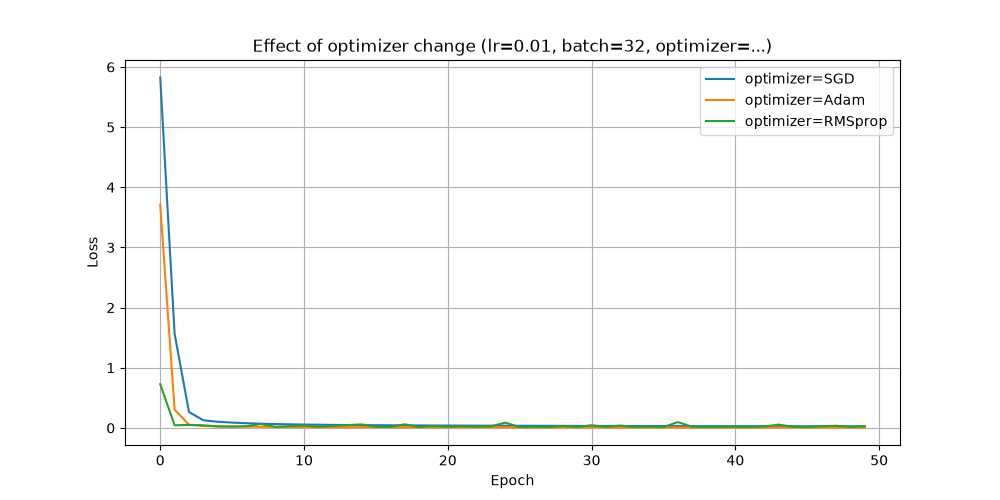

## Домашнее задание №2
### Выполнил: Анненков Арсений Алексеевич

## Задание 1: Модификация существующих моделей
### 1.1 Расширение линейной регрессии
**Регуляризация L1** добавляет в loss сумму модулей всех весов, а **L2** - сумму квадратов всех весов. Первый заставляет многие веса стать точно равными нулю, а второй заставляет веса быть равномерно маленькими.

**Early stopping** останавливает обучение, когда ошибка на валидации перестает снижаться и начинает расти, и возвращает веса из той эпохи, где ошибка на валидации была минимальной, тем самым предотвращая переобучение.
### 1.2 Расширение логистической регрессии
В случае с наличием нескольких классов в регрессии используется функция softmax на выходе, модель обобщается на использование нескольких классов.

Метрики **precision, recall, F1, ROC-AUС** - классический набор для оценки модели. **ROC-AUC** в многоклассовой задачи считается по схеме one-vs-rest.

| Precision | Recall | F1 | ROC-AUC |
|---|---|---|---|
| 0.9675 | 0.9675 | 0.9675 | 0.9915 |
## Задание 2: Работа с датасетами
Класс **CustomDataset** наследует **torch.utils.data.Dataset**. Он загружает данные из csv файла, кодирует категориальные признаки через LabelEncoder, способен нормализовать числовые признаки.

Файл с датасетом для регрессии **BostonHousing.csv** и файл для классификация **Titanic-Dataset.csv** из папки **data**. Для моделей используются линейная и логическая регрессии из прошлого задания.

**Boston Dataset:**
| Epoch | 20 | 40 | 60 | 80 |
|---|---|---|---|---|
| Loss | 17474.4590 | 11143.3633 | 7965.1377 | 10189.5986 |

Boston Housing MSE: 6764.8070

**Titanic Dataset:**
| Accuracy | Precision | Recall | F1 |
|---|---|---|---|
|0.6885 | 0.6618 | 0.6885 | 0.6553 |

## Задание 3: Эксперименты и анализ
### 3.1 Исследование гиперпараметров
**Скорость обучения** проверяется для трёх значений 0.1, 0.01, 0.001. Этот параметр самый чувствительный из всех, слишком большое значение может "расшатать" кривую, а слишком маленький будет долго учится. Оптимальные варианты находятся в диапазоне от 0.01 до 0.1.

**Размер пакета** проверяется на значениях 16, 32, 64. Он влияет скорее на время обучения чем на loos.

**Оптимизатор** проверялся SGD, Adam, RMSprop. Они приблизительно равны, но Adam даёт минимальное отклонение.

### 3.2 Feature Engineering
С помощью **Feature Engineering** можно значительно повысить качество модели.
| Model | Base Features | Polynomial Features | Features Interactions | Statistic Features |
|---|---|---|---|---|
| MSE | 1351.55 | 767.52 | 919.85 | 674.62 |
